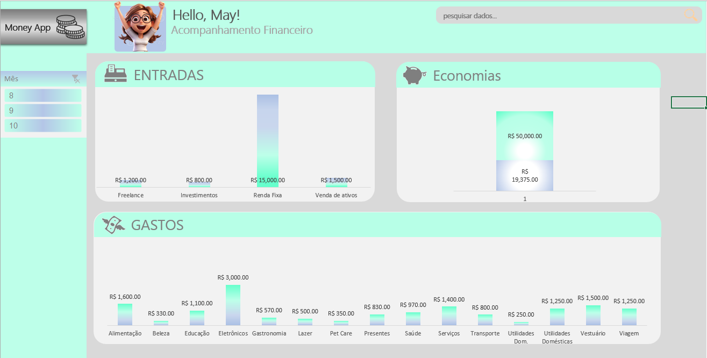

# Planilha de Gestão Financeira
 > ℹ️ **NOTE:** Este é o repositório desenvolvido durante o curso Bootcamp Caixa na plataforma da [DIO](https://dio.me)

Projeto com o objetivo de gerar uma planilha financeira inteligente com as facilidades das ferramentas Microsoft.
Seguem todos os prompts abaixo.

<a href="https://github.com/MayMoreschi/Planilha-Financeira-Inteligente/blob/main/spreadsheet.xlsx" title="View PDF now"> 📕Clique AQUI para baixar o arquivo</a>

# Sobre a Planilha
- A planilha foi projetada para facilitar o controle financeiro pessoal ou familiar, utilizando recursos avançados do Excel. Ela permite:
- Registro de entradas e saídas financeiras: controle detalhado de receitas e despesas diretamente na aba "Data".
- Cálculo do dinheiro economizado: análise automática do saldo disponível.
- Dashboard interativo: exibe gráficos e tabelas dinâmicas gerados a partir dos dados inseridos, permitindo uma visão clara e detalhada das finanças.
  
# Recursos
- Tabelas dinâmicas: organizam os dados automaticamente para facilitar a análise.
- Gráficos interativos: fornecem uma representação visual das informações financeiras.
- Automação do Dashboard: os resultados são gerados automaticamente com base nos dados inseridos na aba "Data".
- Simples e intuitiva: ideal para qualquer pessoa que deseja gerenciar suas finanças com eficiência.
  
# Como Utilizar
1. Faça o download da planilha.
2. Abra o arquivo no Microsoft Excel.
3. Preencha a aba "Data" com as informações de entradas e saídas financeiras.
4. Acesse o Dashboard para visualizar gráficos, tabelas dinâmicas e análises automáticas de seus dados.

## 👨‍💻 Expert

    
&nbsp&nbsp&nbspMayara Moreschi 
    &nbsp&nbsp&nbsp
    <a href="https://github.com/MayMoreschi">
    GitHub</a>&nbsp;|&nbsp;
    <a href="www.linkedin.com/in/

  

---

⌨️ com 💜 por [Mayara Moreschi](https://github.com/MayMoreschi)
